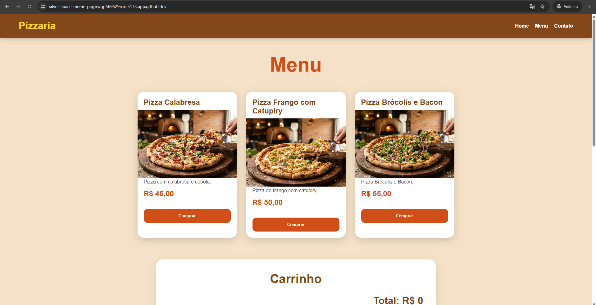
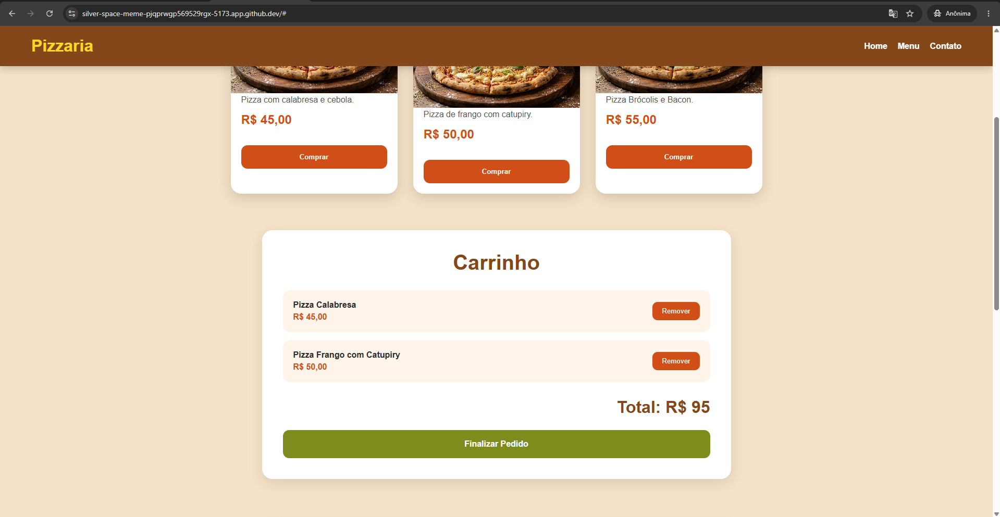
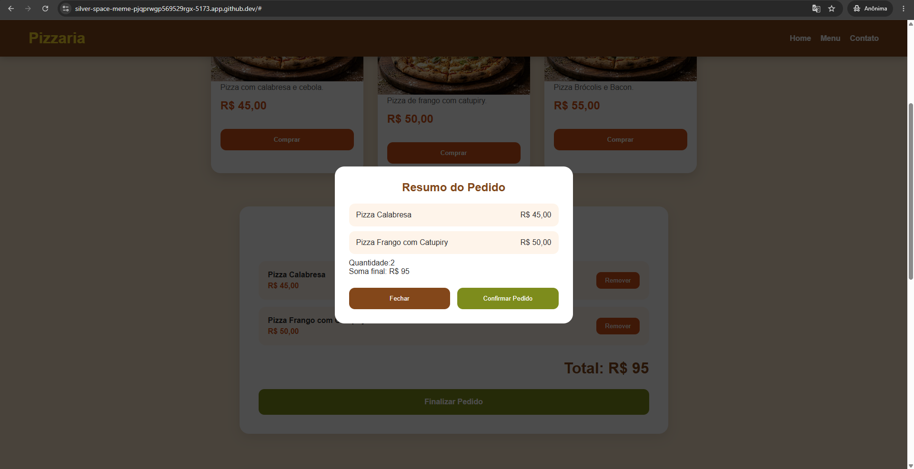
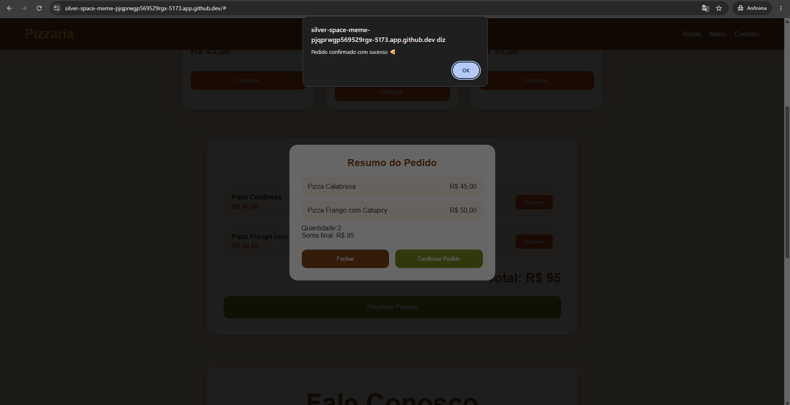
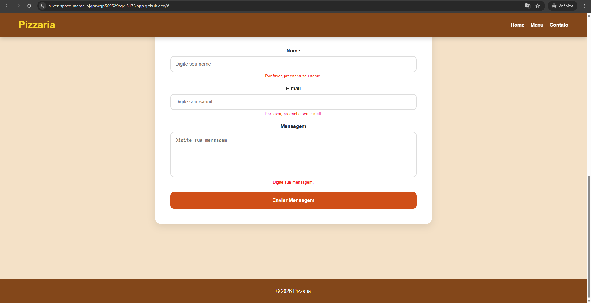
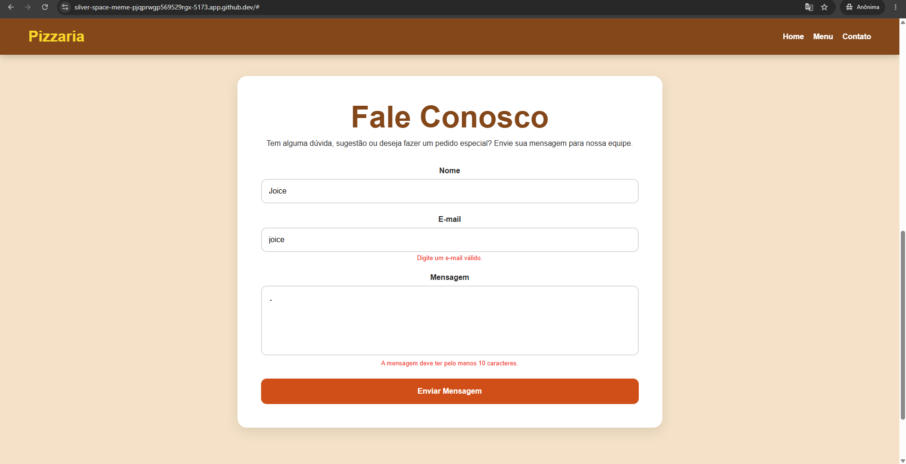
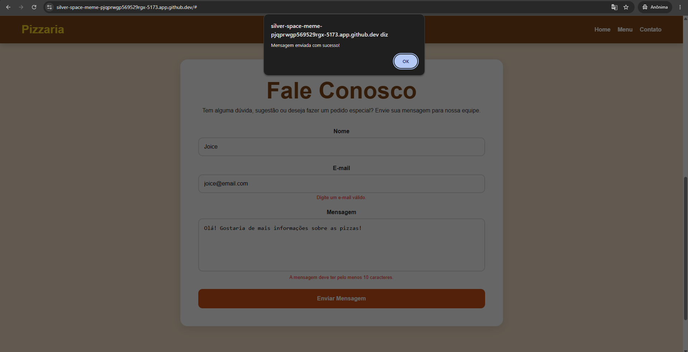

# Pizzaria React - Atividade 5

## Descrição
Conversão completa do projeto da pizzaria para React, mantendo todas as funcionalidades anteriores e utilizando React Hooks para gerenciamento de estados.

---

## Funcionalidades

- Carrinho dinâmico
- Remoção de itens
- Modal de resumo do pedido
- Persistência com localStorage
- Formulário de contato validado
- React Hooks
- useState
- useEffect
- Interface moderna e responsiva

---

## Tecnologias Utilizadas

- React
- Vite
- JavaScript
- CSS3

---

## Como Executar pelo Terminal

### 1. Abrir o projeto no GitHub Codespaces

### 2. Abrir o terminal

### 3. Instalar as dependências:

```bash
npm install
```

### 4. Executar o projeto:

```bash
npm run dev
```

### 5. Abrir no navegador o link exibido no terminal

Exemplo:

```bash
http://localhost:5173
```

---

## Prints do Projeto













